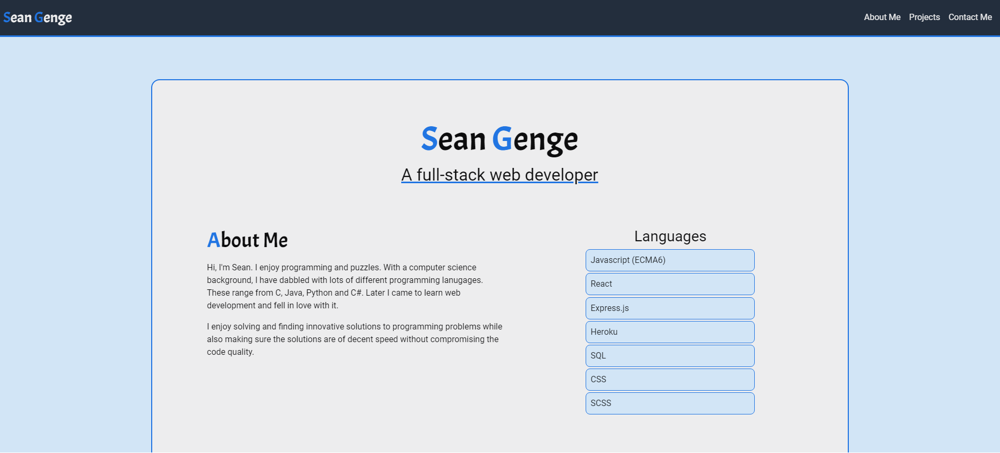

# Sean Genge's Portfolio [](https://opensource.org/licenses/MIT)

## Description
My Portfolio showcasing some of my works. The finished portfolio is hosted on heroku on: https://sean-genge.herokuapp.com/

## Table of Contents
- [Languages/Tools Used](#languagestools-used)

- [Installation](#installation)
  
- [Usage](#usage)
  
- [License](#license)

### Preview of the portfolio



## Languages/Tools Used
 - JavaScript
 - HTML
 - React
 - NodeJs
 - Webpack
 - Babel
 - ExpressJs
 - SCSS

## Installation
To install the necessary dependencies, run the following command:
```
  npm i
```

## Usage
- npm run dev: This is for development. Compiles the files and start the server locally. Does not minify the files.
- npm run build: This is for production. Compiles and minifies the files in the dist folder.

## License
This project is licensed under the [MIT](https://opensource.org/licenses/MIT) license
